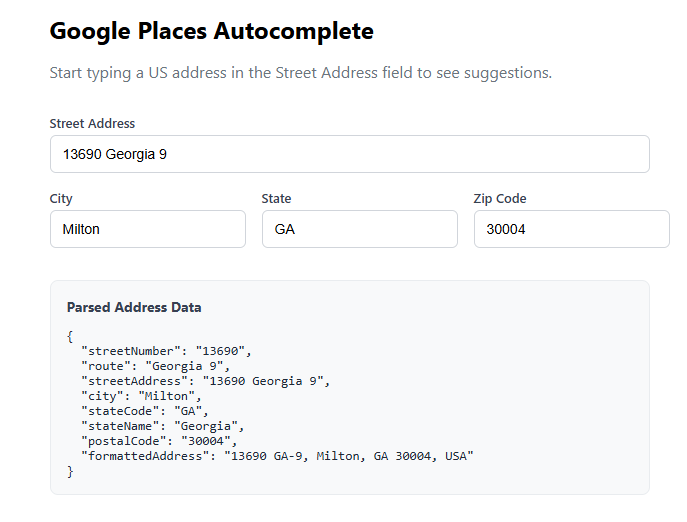

# Google Places Autocomplete - Angular Example

Example Angular project demonstrating a custom Google Places Autocomplete directive.



## Setup

1. Get a Google API key with the **Places API (New)** enabled from the [Google Cloud Console](https://console.cloud.google.com/).

2. Add your API key to `src/environments/environment.ts`:

   ```typescript
   export const environment = {
     google: {
       placesApiKey: 'YOUR_ACTUAL_API_KEY',
     },
   };
   ```

3. Install dependencies and run:

   ```bash
   npm install
   ng serve
   ```

4. Open `http://localhost:4200` and start typing a US address.

## Project Structure

```
src/app/
  directives/google-places.directive.ts   # The autocomplete directive
  models/google-place-address.ts          # Address interface
  services/google-places-loader.service.ts # Lazy script loader
  services/google-places.token.ts         # DI token for API key
  app.ts                                  # Demo component
  app.html                                # Demo template
  app.scss                                # Demo styles
src/styles.scss                           # Global dropdown styles
```
